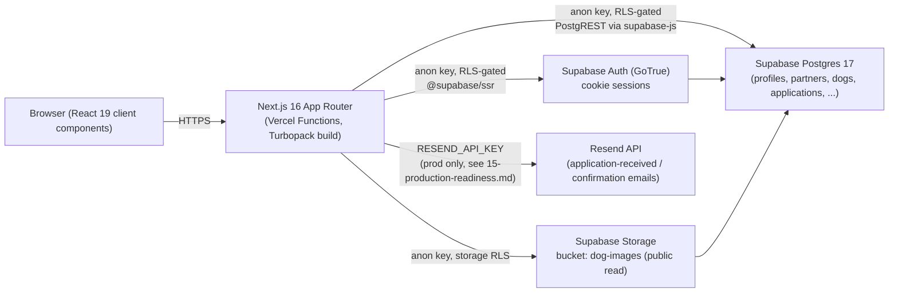
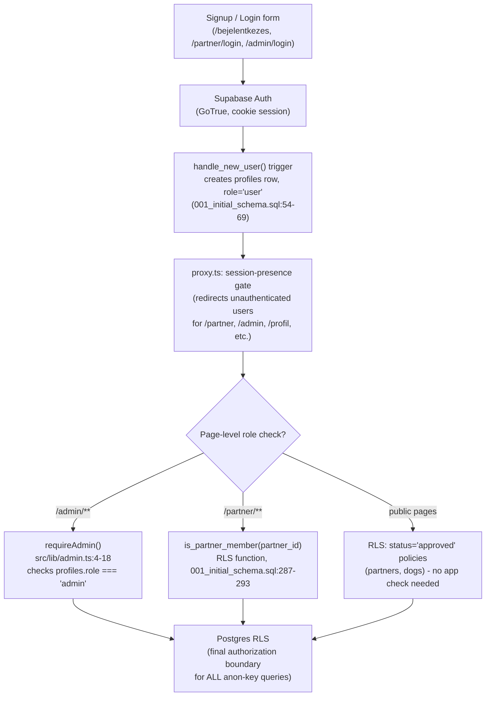

# 01 — Technical Architecture

Audit date: 2026-09-06. Repo: `/Users/bankirichard/Developer/MyDog projekt/rescueconnect`. Read-only audit; no source was modified.

## 1. Stack summary (with evidence)

| Layer | Value | Evidence |
|---|---|---|
| Framework | Next.js **16.2.10**, App Router, Turbopack | `package.json:15` (`"next": "16.2.10"`); `package-lock.json` resolved `node_modules/next` → `"version": "16.2.10"`; build output banner: `▲ Next.js 16.2.10 (Turbopack)` (captured in `npm run build`, see 16-test-and-build-report.md) |
| Router mode | App Router only (no `pages/`) | `find src -type f` shows only `src/app/**` route files, no `src/pages` directory exists |
| React | **19.2.4** | `package.json:16-17` (`"react": "19.2.4"`, `"react-dom": "19.2.4"`); package-lock confirms resolved version `19.2.4` |
| TypeScript | `^5`, **strict mode on** | `package.json:32` (`"typescript": "^5"`); `tsconfig.json:8` `"strict": true` |
| TS config detail | target ES2017, bundler resolution, path alias `@/*` → `./src/*`, `noEmit: true` | `tsconfig.json:2,10,20-22` |
| Tailwind | v4 (`^4`), PostCSS plugin form, no `tailwind.config.*` file (v4 CSS-first config) | `package.json:34` (`"tailwindcss": "^4"`); resolved `4.3.2` in `package-lock.json`; `postcss.config.mjs:3` uses `"@tailwindcss/postcss": {}`; `find` shows no `tailwind.config.ts/js` in repo root — config lives in `src/app/globals.css` (Tailwind v4 convention) |
| UI kit | shadcn (`style: "base-nova"`) + lucide-react icons | `package.json:20` (`"shadcn": "^4.12.0"`), `:14` (`"lucide-react": "^1.23.0"`); `components.json:1-20` full shadcn config (baseColor neutral, cssVariables true, icon lib lucide) |
| Other UI deps | `@base-ui/react` (headless primitives), `class-variance-authority`, `clsx`, `tailwind-merge`, `tw-animate-css` | `package.json:9,17,19,35-36` |
| Email | Resend (`resend` npm package) | `package.json:18` (`"resend": "^6.17.1"`); implementation in `src/lib/email.ts:1,7,12` |
| Payments | **NOT_FOUND** — no Stripe/PayPal/payment SDK in dependencies | `package.json` dependencies list (lines 9-22) contains no payment library; `grep -rniE "stripe|paypal|payment" src package.json` returned zero matches in `src/` and `package.json` (a `stripe_payment_id text` column exists only as an unused schema placeholder, see §5) |
| Analytics | **NOT_FOUND** | `grep -rniE "posthog|segment|google-analytics|gtag|@vercel/analytics|@vercel/speed-insights" src package.json package-lock.json` returned no hits in `src/` or `package.json` (only incidental substring noise in `package-lock.json`, e.g. `has-tostringtag`); `src/app/layout.tsx` (full file read) has no analytics script/provider |
| Error tracking / monitoring | **NOT_FOUND** | `grep -rniE "sentry|logrocket|datadog|bugsnag" src package.json` returned zero matches |
| Maps / geolocation | **NOT_FOUND** | `grep -rniE "leaflet|mapbox|google.?maps|geolocation|navigator\.geolocation" src` returned zero matches. Country/city fields (`dogs.country`, `dogs.city`) are plain text/enum-like dropdowns (`src/components/KutyakFilters.tsx:6-17`), not map-based |
| Test framework | **NOT_FOUND** — 0 automated tests | `find . -iname "*.test.*" -o -iname "*.spec.*" | grep -v node_modules` → no output; no `test` script in `package.json` (only `dev`, `build`, `start`, `lint` at `package.json:5-8`); no vitest/jest/playwright in dependencies |
| CI/CD | **NOT_FOUND** | `.github/workflows` directory does not exist (`find .github -type f` → no output/no such directory) |
| Deployment | Vercel, project name **mydog** | `.vercel/project.json`: `{"projectId":"prj_Us9EmOj2kmmJMpmnnI76Qwc9GUIU","orgId":"team_94QWqRv3pYBRSWBf02ADX6Z3","projectName":"mydog"}`; production alias `https://rescueconnect-nu.vercel.app` confirmed via `vercel inspect https://rescueconnect-nu.vercel.app` → Aliases list includes `rescueconnect-nu.vercel.app` |

## 2. Supabase usage — client vs server vs middleware

Three separate Supabase client constructions exist, all using only the **public anon key** (no service-role key anywhere in source):

- **Browser client** — `src/lib/supabase/client.ts:3-8`, `createBrowserClient(NEXT_PUBLIC_SUPABASE_URL, NEXT_PUBLIC_SUPABASE_ANON_KEY)`.
- **Server client** (RSC/Server Actions/Route Handlers) — `src/lib/supabase/server.ts:4-22`, `createServerClient(...)` wired to Next's `cookies()` (line 2, 5) for session propagation, same URL/anon-key env vars (lines 7-8).
- **Proxy (edge middleware equivalent)** — `src/proxy.ts:8-23`, a third `createServerClient` instance used purely for session refresh + route gating (see §4 below). Same anon-key pattern (lines 9-10).

`grep -rn "process.env" src` (full results in §6) shows no `SUPABASE_SERVICE_ROLE_KEY` reference anywhere — all data access, including from admin pages, goes through the anon key and is therefore gated entirely by Postgres RLS policies (see `supabase/migrations/001_initial_schema.sql`, discussed in §5).

## 3. Database & storage

- **Database**: Postgres via Supabase, project ref `eikkgaocpkhwdgndiupm` (region eu-central-1), confirmed live via `supabase projects list` → `{"id":"eikkgaocpkhwdgndiupm", ... "status":"ACTIVE_HEALTHY","database":{"host":"db.eikkgaocpkhwdgndiupm.supabase.co","version":"17.6.1.155","postgres_engine":"17"}}`.
- **Schema**: 10 migration files, `supabase/migrations/001_initial_schema.sql` through `010_partner_follow_notifications.sql` (`find supabase -type f`). Migration 001 (347 lines, fully read) defines: enums (`partner_type`, `partner_status`, `dog_gender`, `dog_size`, `dog_status`, `application_status`, `donation_payment_status`, `virtual_adoption_status`, `notification_type` — lines 4-39), core tables `profiles`, `partners`, `partner_members`, `dogs`, `media`, `adoption_applications`, `donations`, `virtual_adoptions`, `notifications`, `activity_logs`, `tags`/`entity_tags`, `favorite_dogs`/`favorite_partners` (lines 44-258), and a full RLS policy set (lines 263-347).
- **Storage**: Supabase Storage bucket `dog-images`, public read / partner-scoped write, created in `supabase/migrations/005_storage_dog_images.sql:4-6` (`public: true, file_size_limit: 5242880 (5MB), allowed_mime_types: image/jpeg, image/png, image/webp`). RLS-style storage policies at lines 9-48 restrict insert/update/delete to the uploading partner's own folder (`(storage.foldername(name))[1] in (select partner_id::text from partner_members where profile_id = auth.uid())`) or admins.
- **Donations/virtual adoptions**: Tables exist (`donations`, `virtual_adoptions` — migration 001 lines 173-196) with a `stripe_payment_id text` column, but there is **no Stripe SDK, no payment API route, and no UI referencing donations** anywhere in `src/` — this is schema scaffolding only, not a working feature (status: **PLACEHOLDER**).

## 4. Auth mechanism

Supabase Auth (GoTrue) via cookie-based sessions (`@supabase/ssr`). Route protection is enforced in `src/proxy.ts` (Next.js 16's renamed middleware — see §8), not per-page checks alone:

- `src/proxy.ts:37-41`: unauthenticated users hitting `/partner/**` (except login/register) are redirected to `/partner/login`.
- `src/proxy.ts:47-49`: unauthenticated users hitting `/admin/**` (except `/admin/login`) are redirected to `/admin/login`.
- `src/proxy.ts:51-55`: unauthenticated users hitting user-account pages (`/profil`, `/kedvencek`, `/jelentkezeseim`, `/mentett-keresesek`) are redirected to `/bejelentkezes`.
- Matcher scope: `src/proxy.ts:64-66`.

Role-based authorization is a **second, independent layer** on top of this, implemented in `src/lib/admin.ts:4-18` (`requireAdmin()`): it re-checks `auth.getUser()` server-side and then queries `profiles.role`, redirecting to `/admin/login?error=unauthorized` if `role !== 'admin'` (lines 9-15). The `profiles.role` column is `text` with a CHECK constraint limited to `'user' | 'partner' | 'admin'` (`supabase/migrations/001_initial_schema.sql:48`), auto-populated on signup via the `handle_new_user()` trigger (`001_initial_schema.sql:54-69`).

The proxy's redirect logic only checks *session presence*, not role — so `requireAdmin()`-style server-side role checks (or RLS) are the actual authorization boundary, not the proxy. This is consistent with the RLS design: `is_admin()` (`001_initial_schema.sql:279-284`) and `is_partner_member()` (`286-293`) are `security definer` SQL functions used throughout the policy set to gate row access at the database layer regardless of what the app layer does.

## 5. Diagrams

### Data flow

### Auth / authorization

## 6. API routes

Only **one** custom API route exists under `src/app/api/**`:

- `POST /api/applications` — `src/app/api/applications/route.ts` (97 lines, fully read). Validates body (dogId/name/email required, email regex `src/app/api/applications/route.ts:8`), re-fetches the dog server-side to derive `partner_id` rather than trusting client input (comment + code at lines 42-47), inserts into `adoption_applications` (lines 53-62), then fires two Resend emails via `Promise.allSettled` so email failures don't fail the submission (lines 71-94).

All other data mutations (favorites, saved searches, follows, profile edits, admin actions, partner dog CRUD) go directly through Supabase client calls from Server Actions / client components rather than custom API routes — confirmed by the `src/app` file listing showing no other files under `api/`.

## 7. Environment variables (every `process.env` reference in `src/`)

Full result of `grep -rn "process.env" src`:

| Variable | File:line | Purpose |
|---|---|---|
| `NEXT_PUBLIC_SUPABASE_URL` | `src/lib/supabase/client.ts:5`, `src/lib/supabase/server.ts:7`, `src/proxy.ts:9` | Supabase project URL, public |
| `NEXT_PUBLIC_SUPABASE_ANON_KEY` | `src/lib/supabase/client.ts:6`, `src/lib/supabase/server.ts:8`, `src/proxy.ts:10` | Supabase anon key, public |
| `NEXT_PUBLIC_SITE_URL` | `src/app/layout.tsx:14`, `src/lib/email.ts:4`, `src/app/kutyak/[id]/page.tsx:207` | Canonical site URL for metadata/emails/share links; falls back to `https://rescueconnect-nu.vercel.app` if unset in all three call sites |
| `RESEND_API_KEY` | `src/lib/email.ts:7` | Resend API key; if unset, `getResend()` returns `null` and logs a warning (`src/lib/email.ts:8-11`), silently skipping email send |
| `EMAIL_FROM` | `src/lib/email.ts:3` | Optional From address override, defaults to `MyDog <onboarding@resend.dev>` |

No other `process.env.*` usages exist in `src/` (this is the complete list). Note: no `SUPABASE_SERVICE_ROLE_KEY` is referenced anywhere in the app.

## 8. Edge/server functions and deployment model

- No standalone edge functions or Supabase Edge Functions directory found (`find supabase -type f` shows only `migrations/`, `.temp/`, `RUN_IN_SUPABASE_*.md`, `seed.sql` — no `functions/`).
- Next.js 16 renamed `middleware.ts` to `proxy.ts` — this repo already uses the new convention (`src/proxy.ts`), confirmed against the bundled Next.js docs shipped in `node_modules/next/dist/docs/01-app/01-getting-started/16-proxy.md` and `node_modules/next/dist/docs/01-app/03-api-reference/03-file-conventions/proxy.md`. The project's `AGENTS.md` explicitly flags this as a "not the Next.js you know" breaking-change area.
- Build output (`npm run build`) shows every route compiled as a dynamic/server-rendered function (`ƒ` marker) — no statically-generated (`○`) pages except boilerplate — plus one `ƒ Proxy (Middleware)` entry, confirming `src/proxy.ts` is active in the build. Full output in `docs/audit-2026-09-launch-readiness/16-test-and-build-report.md`.
- Deployment target: Vercel Functions (implied by `λ` markers in `vercel inspect` build output, e.g. `λ index (1.22MB) [iad1]`), region `iad1`.

## 9. Image handling

- `next.config.ts:5-15` configures `images.remotePatterns` for exactly two hosts: `images.unsplash.com` (placeholder/stock dog photos, see fallback image URL in `src/app/kutyak/page.tsx:257`) and `eikkgaocpkhwdgndiupm.supabase.co` with `pathname: "/storage/v1/object/public/**"` (Supabase Storage public objects).
- `next/image` (`<Image>` from `"next/image"`) is used for dog cards, e.g. `src/app/kutyak/page.tsx:2,265-271` (`fill`, responsive `sizes` prop).
- No other image CDN/host is configured — any dog photo not uploaded to the `dog-images` Supabase bucket or not from `images.unsplash.com` would fail Next's image optimizer (INFERENCE, based on `remotePatterns` being an allowlist).

## 10. Search implementation

Confirmed **server-side, database-filtered search** — not client-side array filtering and not Postgres full-text search (`tsvector`/`to_tsquery`):

- `src/app/kutyak/page.tsx:97-142`: builds a Supabase query with `.eq("status","available")`, optional `.or("name.ilike.%q%,breed.ilike.%q%")` for the text query (line 105, case-insensitive `LIKE`, not FTS), plus `.eq()` filters for country/city/size/gender/transportable and `.gte/.lte` range filters for age buckets, `.order()` for sort, and `.range()` for pagination (line 142).
- Filter UI (`src/components/KutyakFilters.tsx`, 238 lines, fully read) is a client component that only manipulates the URL's query string (`router.push`, lines 58-69) — the actual filtering happens in the server component (`kutyak/page.tsx`) on each navigation, not in-browser.
- No search index (Algolia, Meilisearch, Elasticsearch, Postgres FTS) is used anywhere — confirmed by absence of such dependencies in `package.json` and absence of `tsvector`/`to_tsquery`/`websearch_to_tsquery` in any migration file (not found when migrations 001–010 were reviewed).

## 11. Known technical risks (plain statements, with evidence of absence)

1. **Zero automated tests.** `find . -iname "*.test.*" -o -iname "*.spec.*" | grep -v node_modules` returns nothing; no test runner in `package.json` devDependencies; no `test` script. Status: **NOT_FOUND**.
2. **No CI/CD pipeline.** No `.github/workflows/` directory exists. Every deploy is a manual `vercel deploy` / git-push-triggered Vercel build with no automated test/lint gate before production. Status: **NOT_FOUND**.
3. **No error tracking / APM.** `grep` for Sentry/LogRocket/Datadog/Bugsnag across `src` and `package.json` found zero matches. Any production runtime error is only visible in Vercel's default function logs (see 15-production-readiness.md). Status: **NOT_FOUND**.
4. **No analytics.** No PostHog/GA/Segment/Vercel Analytics found in dependencies or `layout.tsx`. The founder has no visibility into user behavior, conversion funnels, or drop-off pre-launch. Status: **NOT_FOUND**.
5. **No rate limiting.** (Cross-referenced in 15-production-readiness.md.) The single POST API route (`/api/applications`) and all Supabase anon-key writes have no application-level rate limiting or CAPTCHA — abuse relies entirely on Supabase's own limits and RLS. Status: **NOT_FOUND**.
6. **Anon-key-only architecture.** Every server and client Supabase call uses the public anon key; there is no service-role usage anywhere in `src/`. This is actually a *positive* signal (all authorization funnels through RLS, reducing the blast radius of an app-layer bug), but it also means RLS policy correctness is the single point of failure for data isolation — a missed policy (e.g. on a new table) would default-open or default-closed depending on whether RLS was enabled on that table. INFERENCE: not independently verified against every table for this report; see 12-security-and-permissions.md for a dedicated RLS audit.
7. **ESLint found 5 real errors** (React purity/effect rules + unescaped-entity rules), not just style nits — see 16-test-and-build-report.md for exact locations. These indicate at least one component (`src/app/admin/dashboard/page.tsx:24`) calls `Date.now()` during render, which is flagged as an impure-render violation under React 19's new compiler-era lint rules.
8. **Payment/donation feature is schema-only.** `donations`/`virtual_adoptions` tables and a `stripe_payment_id` column exist in the DB schema (migration 001) but there is no Stripe integration, no donation UI, and no donation API route anywhere in `src/`. Status: **PLACEHOLDER**.
