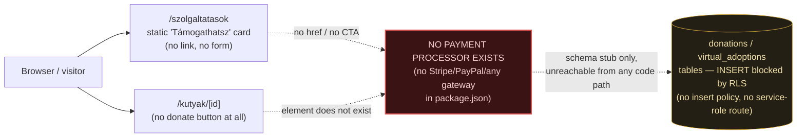

# 07 — Money Flow & Revenue Readiness

Scope: every revenue stream named in the audit spec (adoption/transaction fee, transport fee/margin,
Dog Club subscription, service marketplace commission, partner Pro subscription, affiliate/insurance/
commerce, one-time donation, recurring donation, virtual adoption, corporate donation, SZJA 1%
informational flow, grants informational flow).

Method: full-repo case-insensitive grep for payment/commerce vocabulary, plus direct reads of the
schema and every route that touches money-shaped tables. Repo: `/Users/bankirichard/Developer/MyDog
projekt/rescueconnect`. No live testing, no server started.

## 0. Baseline: is there a payment stack at all?

`package.json` (read in full):

```
dependencies: @base-ui/react, @supabase/ssr, @supabase/supabase-js, class-variance-authority,
clsx, lucide-react, next, react, react-dom, resend, shadcn, tailwind-merge, tw-animate-css
devDependencies: @tailwindcss/postcss, @types/node, @types/react, @types/react-dom, eslint,
eslint-config-next, tailwindcss, typescript
```

There is no Stripe/PayPal/Braintree/Adyen/GoCardless/Barion/SimplePay SDK, and no generic HTTP
client added for calling out to one (no `axios`, no custom fetch wrapper for a payment API).
`resend` is present but is only an outbound transactional-email client (see §9).

Repo-wide grep (`grep -rni <term> src supabase`, node_modules/.next excluded), hit counts:

| Term | Hits | Files |
|---|---|---|
| `stripe` | 1 | `supabase/migrations/001_initial_schema.sql` (column name `stripe_payment_id`, never read/written in app code — confirmed by `grep -rn "stripe_payment_id" src` = 0 hits) |
| `paypal` | 0 | — |
| `checkout` | 0 | — |
| `payment` | 3 | `supabase/migrations/001_initial_schema.sql` only (enum `donation_payment_status`, column `payment_status`, comment) |
| `subscription` | 0 | — |
| `club` | 0 | — |
| `donation` | 8, all in `supabase/migrations/001_initial_schema.sql` (enum, table, columns, RLS policy names/comments) | 0 hits in `src/` |
| `commission` | 0 | — |
| `invoice` | 0 | — |
| `payout` | 0 | — |
| `webhook` | 0 | — |
| `szja` | 0 | — |
| `1%` / "1 százalék" | 0 | — |

`grep -rn "donation" src --include="*.tsx" --include="*.ts"` (application code only, migrations
excluded) → **0 matches**. `grep -rn "virtual_adopt\|virtualAdopt" src` → **0 matches**. No component,
page, or API route in `src/app` or `src/components` references the `donations` or `virtual_adoptions`
tables, in any form (insert, select, or even a "coming soon" label wired to real data).

Migrations 002–010 (`002_partner_portal.sql`, `003_contact_rls.sql`, `004_admin_portal.sql`,
`005_storage_dog_images.sql`, `006_partner_applications.sql`, `007_adoption_notifications.sql`,
`008_saved_searches.sql`, `009_saved_search_notifications.sql`, `010_partner_follow_notifications.sql`)
were grepped individually for the same term list — **zero hits in all nine files** for stripe, paypal,
checkout, payment, subscription, club, donation, commission, invoice, payout, webhook. None of them
touch `donations` or `virtual_adoptions` at all (confirmed by reading grep output, not just counting).

## 1. `donations` / `virtual_adoptions`: schema exists, no write path exists anywhere

`supabase/migrations/001_initial_schema.sql:173-196`:

```sql
create table donations (
  id uuid primary key default gen_random_uuid(),
  partner_id uuid references partners(id),
  dog_id uuid references dogs(id),
  donor_id uuid references profiles(id),
  amount numeric(10,2) not null,
  currency text not null default 'EUR',
  payment_status donation_payment_status not null default 'pending',
  stripe_payment_id text,
  message text,
  created_at timestamptz not null default now()
);

create table virtual_adoptions (
  id uuid primary key default gen_random_uuid(),
  dog_id uuid not null references dogs(id),
  user_id uuid not null references profiles(id),
  monthly_amount numeric(10,2) not null,
  started_at timestamptz not null default now(),
  status virtual_adoption_status not null default 'active'
);
```

RLS (`001_initial_schema.sql:342-343`):

```sql
create policy "Users see own donations" on donations for select using (donor_id = auth.uid());
create policy "Users see own virtual adoptions" on virtual_adoptions for select using (user_id = auth.uid());
```

These are the **only** policies on either table. There is no `for insert`, `for update`, or `for all`
policy on `donations` or `virtual_adoptions` in migration 001, and migrations 002–010 never
`alter policy`/`create policy` on either table (grep confirmed, §0). RLS defaults to deny, so with
the anon/authenticated Supabase key used by the client (`src/lib/supabase/client.ts`,
`src/lib/supabase/server.ts` — both instantiate with the public anon key, no service-role key
referenced anywhere in `src`, confirmed by `grep -rn "SERVICE_ROLE" src` = 0 hits): **no browser
session, logged in or not, can insert a row into either table.** There is also no server-side route
(`src/app/api/*`) that uses a service-role client to insert on the user's behalf — the only API route
in the whole app is `src/app/api/applications/route.ts` (adoption applications, unrelated).

Conclusion: `donations` and `virtual_adoptions` are inert schema stubs. Even a determined
tester/attacker cannot create a row through the app's normal Supabase credentials, and no UI anywhere
attempts to. Comment in the migration itself says as much: `-- DONATIONS (schema ready, frontend
later)` / `-- VIRTUAL ADOPTIONS (schema ready, frontend later)` (`001_initial_schema.sql:171,187`).

## 2. Revenue-stream-by-revenue-stream table

Status vocabulary used below: WORKING, PARTIAL, UI_ONLY, BACKEND_ONLY, PLACEHOLDER, BROKEN, BLOCKED,
NOT_FOUND, NOT_VERIFIED.

| Revenue stream | UI | Checkout/payment action | Provider | Webhook | DB persistence | Invoice/receipt | Subscription lifecycle | Refund | Cancellation | Payout | Commission logic | Tax/VAT metadata | Prod secret configured | Live tested | **Status** |
|---|---|---|---|---|---|---|---|---|---|---|---|---|---|---|---|
| Adoption/transaction fee | NOT_FOUND — `adoption_applications` table (`001_initial_schema.sql:156-168`) has no `amount`/`fee` column; application flow (`src/app/api/applications/route.ts`) is a free contact-request form, not a paid transaction | NOT_FOUND | NOT_FOUND | NOT_FOUND | NOT_FOUND | NOT_FOUND | N/A | N/A | N/A | N/A | NOT_FOUND | NOT_FOUND | NOT_FOUND | NOT_FOUND | **NOT_FOUND** |
| Transport fee/margin | UI_ONLY — `/szolgaltatasok` lists "Szállítás & Logisztika" as a marketing card (`src/app/szolgaltatasok/page.tsx:7`); `transport` exists as a `partner_type` enum value (`001_initial_schema.sql:6`) and in `PARTNER_TYPES` (`src/app/partner/register/page.tsx:16`) | NOT_FOUND | NOT_FOUND | NOT_FOUND | NOT_FOUND | NOT_FOUND | N/A | N/A | N/A | N/A | NOT_FOUND — no fee/margin column anywhere | NOT_FOUND | NOT_FOUND | NOT_FOUND | **PLACEHOLDER** |
| Dog Club subscription | NOT_FOUND — see report 09 for full detail; zero hits for "club" anywhere in `src`, `supabase`, or page copy | NOT_FOUND | NOT_FOUND | NOT_FOUND | NOT_FOUND | NOT_FOUND | NOT_FOUND | NOT_FOUND | NOT_FOUND | NOT_FOUND | NOT_FOUND | NOT_FOUND | NOT_FOUND | NOT_FOUND | **NOT_FOUND** |
| Service marketplace commission | UI_ONLY — see report 10; `partners.type` enum supports vet/dog_school/boarding/grooming/walker/dog_friendly_place, but no booking/checkout flow exists for any of them, only a static contact card on the partner profile page (`src/app/partners/[slug]/page.tsx:246-290`) | NOT_FOUND | NOT_FOUND | NOT_FOUND | NOT_FOUND | NOT_FOUND | N/A | N/A | N/A | N/A | NOT_FOUND | NOT_FOUND | NOT_FOUND | NOT_FOUND | **NOT_FOUND** |
| Partner Pro subscription | NOT_FOUND — `partners` table has no `plan`/`tier`/`subscription_status` column (full column list read, `001_initial_schema.sql:74-93`); partner-facing pages (`src/app/partner/dashboard`, `src/app/partner/profile/page.tsx`) have no pricing/plan/billing section | NOT_FOUND | NOT_FOUND | NOT_FOUND | NOT_FOUND | NOT_FOUND | NOT_FOUND | NOT_FOUND | NOT_FOUND | NOT_FOUND | NOT_FOUND | NOT_FOUND | NOT_FOUND | NOT_FOUND | **NOT_FOUND** |
| Affiliate / insurance / commerce | NOT_FOUND — grep for "affiliate", "insurance", "biztosítás", "shop", "webshop", "kupon" across `src` = 0 hits (verified in this session) | NOT_FOUND | NOT_FOUND | NOT_FOUND | NOT_FOUND | NOT_FOUND | NOT_FOUND | NOT_FOUND | NOT_FOUND | NOT_FOUND | NOT_FOUND | NOT_FOUND | NOT_FOUND | NOT_FOUND | **NOT_FOUND** |
| One-time donation | UI_ONLY (weakest form) — `/szolgaltatasok` has a static "🎁 Támogathatsz" card with no link/button/form (`src/app/szolgaltatasok/page.tsx:11`, confirmed no `href` attached to that card, only page-level CTAs to `/kutyak` and `/csatlakozas`); no donate button exists on `/kutyak/[id]` (`grep -n "donat\|Adományoz\|Támogat" "src/app/kutyak/[id]/page.tsx"` = 0 hits) or anywhere in `src/app/page.tsx` or `src/components` | NOT_FOUND | NOT_FOUND | NOT_FOUND | NOT_FOUND — RLS blocks insert, see §1 | NOT_FOUND | N/A | N/A | N/A | NOT_FOUND | NOT_FOUND | NOT_FOUND | NOT_FOUND | **PLACEHOLDER** |
| Recurring donation | NOT_FOUND — no recurrence concept anywhere near `donations` table (single `created_at`, no `interval`/`frequency` column) | NOT_FOUND | NOT_FOUND | NOT_FOUND | NOT_FOUND | NOT_FOUND | NOT_FOUND | NOT_FOUND | NOT_FOUND | NOT_FOUND | NOT_FOUND | NOT_FOUND | NOT_FOUND | **NOT_FOUND** |
| Virtual adoption | BACKEND_ONLY (schema-only, no backend logic either) — `virtual_adoptions` table exists (`001_initial_schema.sql:189-196`) with `monthly_amount` and `status` enum (`active`/`paused`/`cancelled`), but zero UI references it (`grep -rn "virtual_adopt" src` = 0), and RLS blocks insert (§1) so even the schema is unreachable | NOT_FOUND | NOT_FOUND | NOT_FOUND | NOT_FOUND | NOT_FOUND | N/A | NOT_FOUND | N/A | NOT_FOUND | N/A | NOT_FOUND | NOT_FOUND | NOT_FOUND | **PLACEHOLDER** (schema stub, unreachable) |
| Corporate donation | NOT_FOUND — no "corporate"/"vállalati"/"sponsor" concept anywhere (`grep -rni "corporate\|vállalati\|sponsor" src` = 0 hits, this session) | NOT_FOUND | NOT_FOUND | NOT_FOUND | NOT_FOUND | NOT_FOUND | NOT_FOUND | NOT_FOUND | NOT_FOUND | NOT_FOUND | NOT_FOUND | NOT_FOUND | NOT_FOUND | **NOT_FOUND** |
| SZJA 1% informational flow | NOT_FOUND — `grep -rni "szja\|1%\|1 százalék\|adószám"` across `src`/`supabase` = 0 hits | N/A | N/A | N/A | N/A | N/A | N/A | N/A | N/A | N/A | N/A | N/A | N/A | N/A | **NOT_FOUND** |
| Grants informational flow | NOT_FOUND — `grep -rni "grant\b\|pályázat"` across `src` returns exactly one hit, `src/app/gyerekeknek/page.tsx:140` ("Rajzpályázat" = children's drawing competition, unrelated to institutional/organizational grants); no grant-funding concept exists anywhere | N/A | N/A | N/A | N/A | N/A | N/A | N/A | N/A | N/A | N/A | N/A | N/A | N/A | **NOT_FOUND** |

## 3. Actual current money flow (as built)

No node in this diagram performs a real charge. The only two "money-shaped" tables in the database
(`donations`, `virtual_adoptions`) cannot be written to by any code path in the repository.



## 4. Verdict

`CURRENT LIVE REVENUE PATHS: 0`

Justification: (a) no payment SDK of any kind is a dependency (`package.json`, verified above);
(b) no route in `src/app/api` performs a checkout, charge, or webhook handler (only
`src/app/api/applications/route.ts` exists, and it is a free adoption-inquiry form, not a payment);
(c) the two tables that model money (`donations`, `virtual_adoptions`) have zero UI wired to them and
zero write-capable RLS policy, so even a manual/attacker-driven insert through the public Supabase
client is rejected; (d) every "revenue" concept named in the audit spec beyond these two tables
(Dog Club, marketplace commission, Pro subscription, affiliate/insurance, SZJA 1%, grants, corporate
donations) returns 0 grep hits in application code — it exists only as marketing copy on
`/szolgaltatasok` and `/rolunk`, or not at all.
